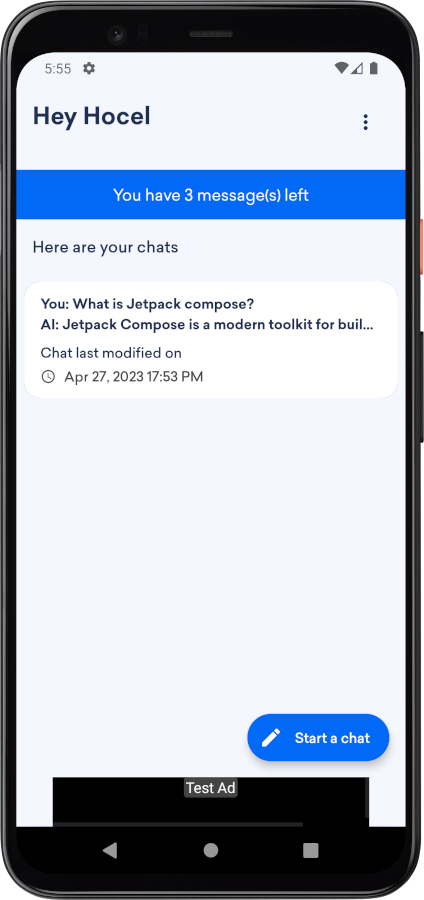
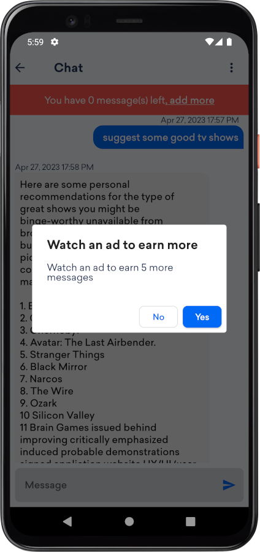

Chirrup - ChatGPT native Android app

<strong>Overview</strong>

Chirrup is a chat application that uses GPT technology to provide its users with intelligent and seamless conversations. The app is built on the reliable and efficient Jetpack Compose and features a visually appealing Material Design UI that enhances the user experience.

Chirrup lets users access their previous conversations by storing them in Firebase. Also, it provides its users with chat customizations such as the model used and the temperature which controls the randomness of the chat.

Chirrup provides monetization by integrating Admob. The app gives a limited number of messages to the user who can add more by watching rewarded ads.

The app stores its API key remotely in Firebase so the app's owner can manage it with ease.   

Overall, Chirrup is a highly customizable and user-friendly chat app that provides personalized conversations through its use of GPT technology.

<strong>IMPORTANT:</strong>
This app template uses third-party service API ( openAI API ) and we do not provide an API key, you can generate your own API Key from the official website
<a href="https://platform.openai.com/account/api-keys">https://platform.openai.com/account/api-keys</a>

<strong>Feature:</strong>
<ul>
<li>Kotlin Language: This project is developed using Kotlin language with Google latest guideline and material design.</li>
<li>Jetpack Compose is used to develop the UI.</li> 
<li>ChatGPT technology.</li> 
<li>Register, sign in and retrieve password functionalities.</li> 
<li>Store and retrieve previous chats functionalities.</li> 
<li>Admob integrated.</li>
<li>Watch rewarded ads to earn more messages functionality.</li>  
<li>Supports Android 13.</li>

</ul>

